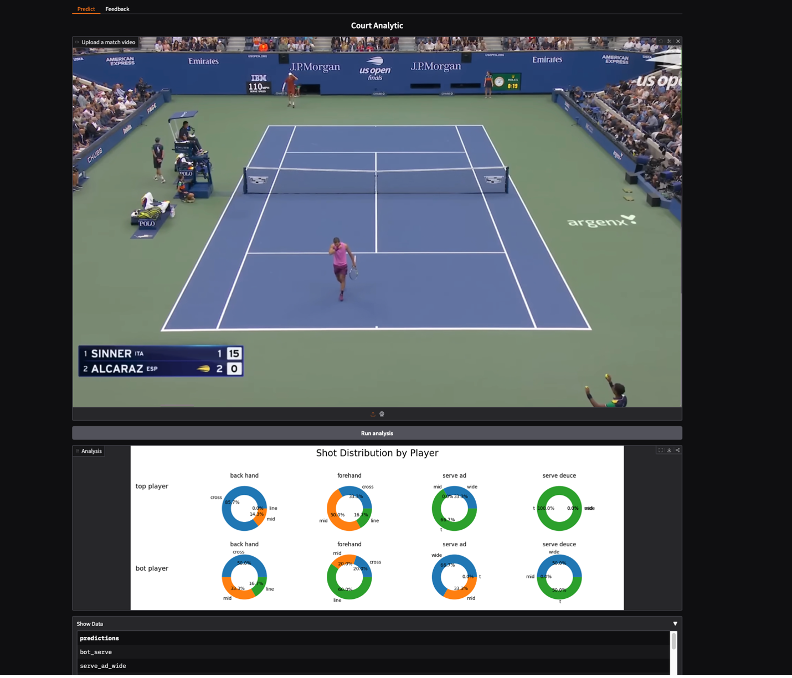

# Court-Analytic-CNN-RNN-Approach

## Abstract
- This is a video recognition model that takes in video input and generate autoregressively the tennis shots that were played in the video.
- The architecture relies on ConvNeXt to model the spatial information, bidirectional GRU to capture temporal dependencies, and a unidirectional GRU for token (shots) generations.
- We also explored a variant of the architecture which incorporated optical flow in a two-stream approach.

## Repo structure
- The model and the training code lives in the main branch
- The Docker deployment/inference code (including the gradio interface) is in the deploy branch
- Optical flow variant lives in the optical_flow_pre_computed branch

## Interface
- The implementation of the model predicts 32 shot categories, but for the simplicity of the demonstration, the current deployment only displays the distribution for forehand, backhand, and serve.


## Architecture


## Reference
- The ConvNeXt was build on the implementation from [CovNeXt](https://github.com/facebookresearch/ConvNeXt).
- The training code took reference from [nanoGPT](https://github.com/karpathy/nanoGPT)

```bibtex
@Article{liu2022convnet,
  author  = {Zhuang Liu and Hanzi Mao and Chao-Yuan Wu and Christoph Feichtenhofer and Trevor Darrell and Saining Xie},
  title   = {A ConvNet for the 2020s},
  journal = {Proceedings of the IEEE/CVF Conference on Computer Vision and Pattern Recognition (CVPR)},
  year    = {2022},
}

@misc{simonyan2014twostreamconvolutionalnetworksaction,
      title={Two-Stream Convolutional Networks for Action Recognition in Videos}, 
      author={Karen Simonyan and Andrew Zisserman},
      year={2014},
      eprint={1406.2199},
      archivePrefix={arXiv},
      primaryClass={cs.CV},
      url={https://arxiv.org/abs/1406.2199}, 
}

@misc{ng2015shortsnippetsdeepnetworks,
      title={Beyond Short Snippets: Deep Networks for Video Classification}, 
      author={Joe Yue-Hei Ng and Matthew Hausknecht and Sudheendra Vijayanarasimhan and Oriol Vinyals and Rajat Monga and George Toderici},
      year={2015},
      eprint={1503.08909},
      archivePrefix={arXiv},
      primaryClass={cs.CV},
      url={https://arxiv.org/abs/1503.08909}, 
}

@misc{bahdanau2016neuralmachinetranslationjointly,
      title={Neural Machine Translation by Jointly Learning to Align and Translate}, 
      author={Dzmitry Bahdanau and Kyunghyun Cho and Yoshua Bengio},
      year={2016},
      eprint={1409.0473},
      archivePrefix={arXiv},
      primaryClass={cs.CL},
      url={https://arxiv.org/abs/1409.0473}, 
}
```
